<div align="center">
  <h1>oeis-tui</h1>
  <p>A TUI and CLI for browsing the On-Line Encyclopedia of Integer Sequences (OEIS) in the terminal.</p>
  <a title="This tool is Tool of The Week on Terminal Trove, The $HOME of all things in the terminal" href="https://terminaltrove.com/"></a>
  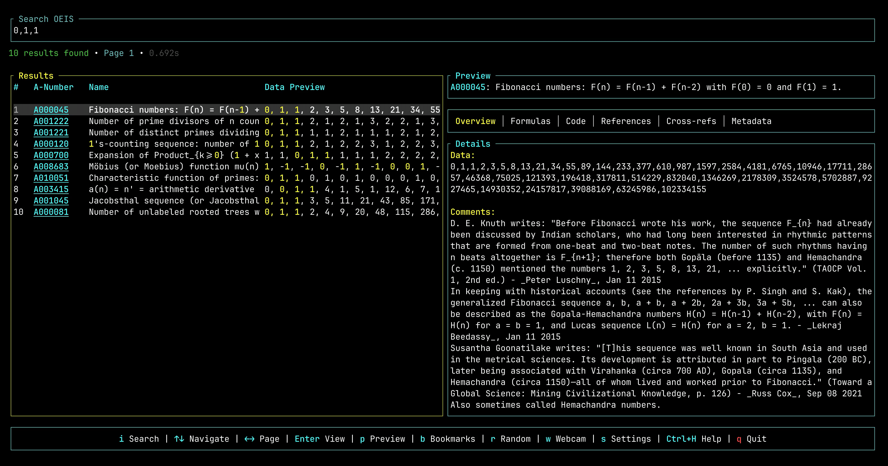
  <br><br>
  <video alt="oeis-tui demo" src="https://github.com/user-attachments/assets/2516f940-ddbb-48df-b816-350510ba6384" width="800" autoplay loop muted playsinline>
    
  </video>
  <p>
    
    
  </p>
</div>

## Installation

### From GitHub Releases

Download the latest binary for your platform from the [releases page](https://github.com/hako/oeis-tui/releases).

### Using Homebrew

```bash
brew install hako/tap/oeis-tui
```

### Using eget

```bash
eget hako/oeis-tui
```

### Using Cargo

```bash
cargo install oeis-tui
```

### Build from Source

Requirements: Rust 1.70 or later

```bash
cd /path/to/oeis/rust
cargo build --release
# binary: target/release/oeis
```

## Features

- **Search & Browse**: Advanced query syntax (id:, keyword:, author:), paginated results
- **Preview Pane**: Live sequence detail preview while browsing results
- **Sequence Details**: 6-tab interface (Overview, Formulas, Code, References, Cross-refs, Metadata)
- **Graph Visualization**: Line, scatter, logarithmic, and pin plot charts
- **Export**: JSON, CSV, TXT, Markdown, and B-File formats with clipboard/file support
- **Bookmarks**: Save sequences with notes for quick access
- **Caching**: SQLite-based persistent caching for offline access
- **Webcam Mode**: Auto-refreshing sequence browser with 4 categories and configurable intervals
- **Themes**: Dark and light themes with runtime switching
- **Customizable Keybindings**: User-configurable keys with presets (default, vim, emacs)
- **Internationalization**: 6 languages (English, French, Japanese, Spanish, Korean, Chinese)
- **Mouse Support**: Click to edit, select, scroll, and navigate
- **CLI Mode**: Non-interactive commands (search, fetch, random)

## Demo Screenshots

<table>
  <tr>
    <td align="center">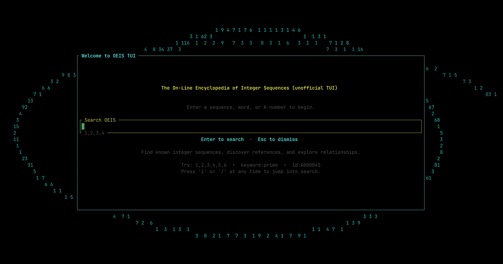<br><sub>Welcome Screen</sub></td>
    <td align="center">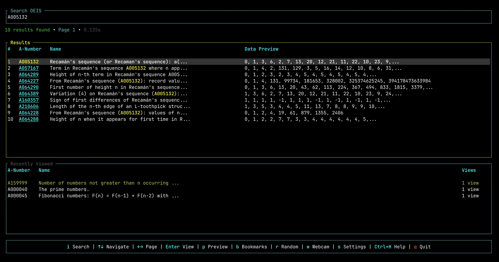<br><sub>Search Results</sub></td>
    <td align="center"><br><sub>Preview Pane</sub></td>
  </tr>
  <tr>
    <td align="center">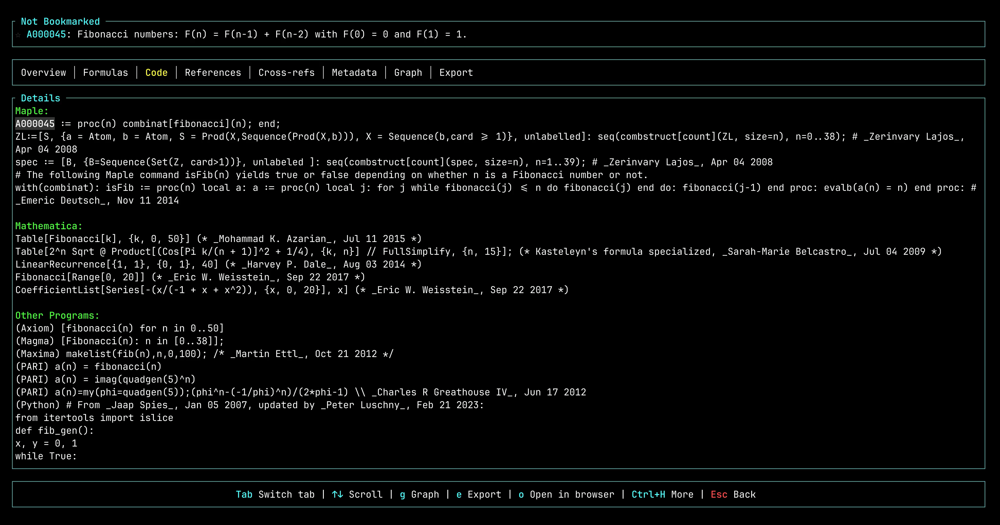<br><sub>Code Tab</sub></td>
    <td align="center">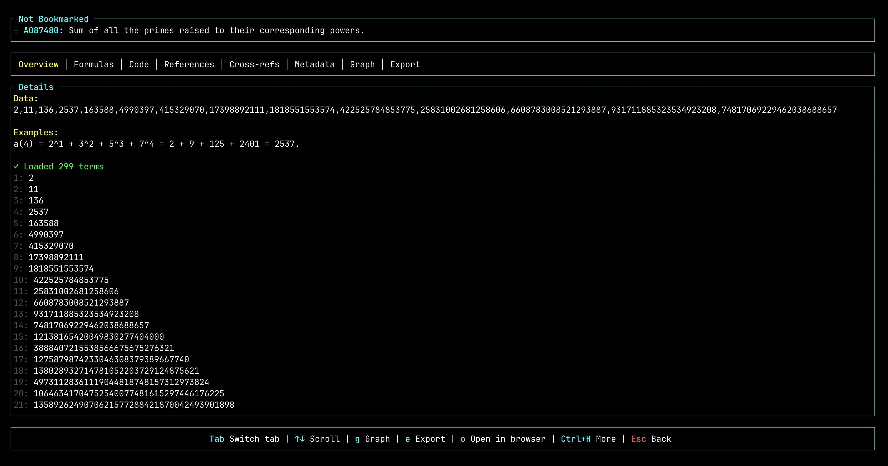<br><sub>B-file Loading</sub></td>
    <td align="center">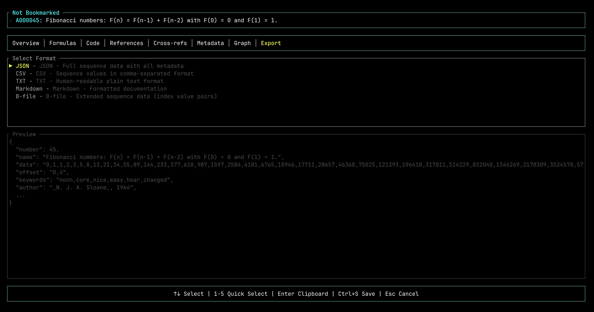<br><sub>Export</sub></td>
  </tr>
  <tr>
    <td align="center">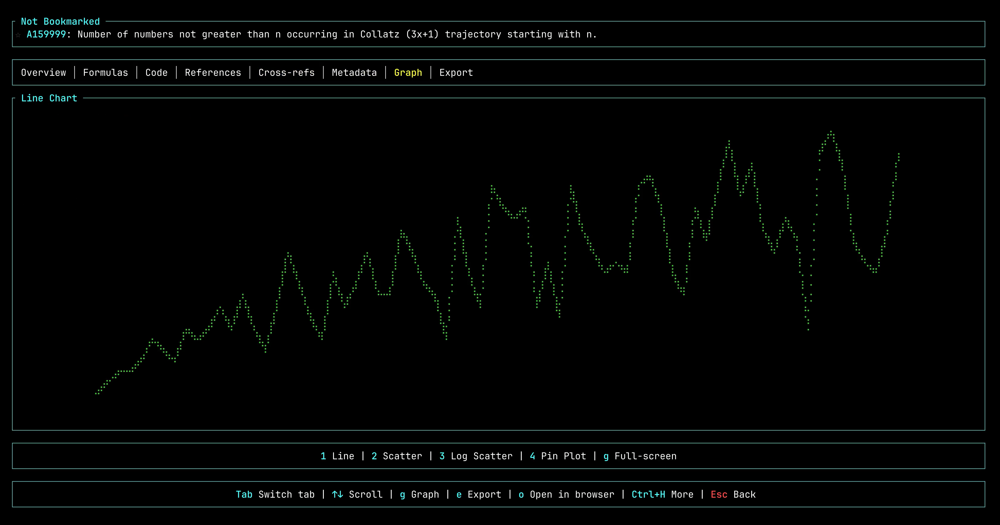<br><sub>Line Chart (Collatz)</sub></td>
    <td align="center">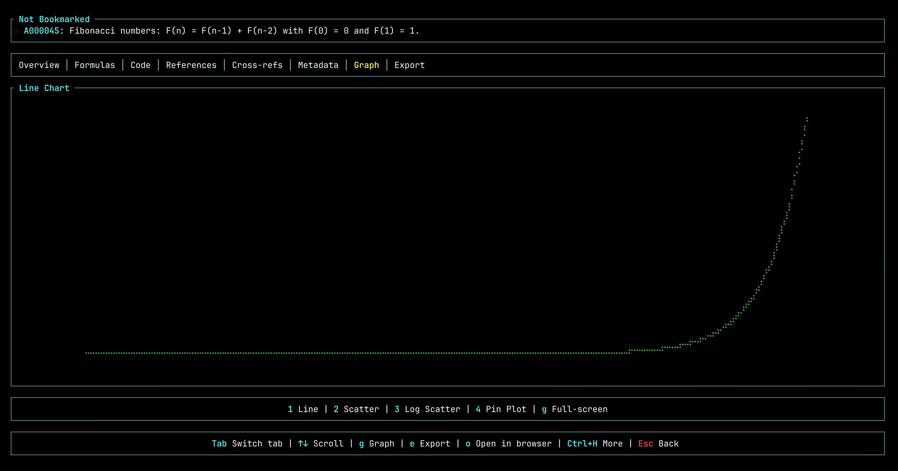<br><sub>Line Chart (Fibonacci)</sub></td>
    <td align="center">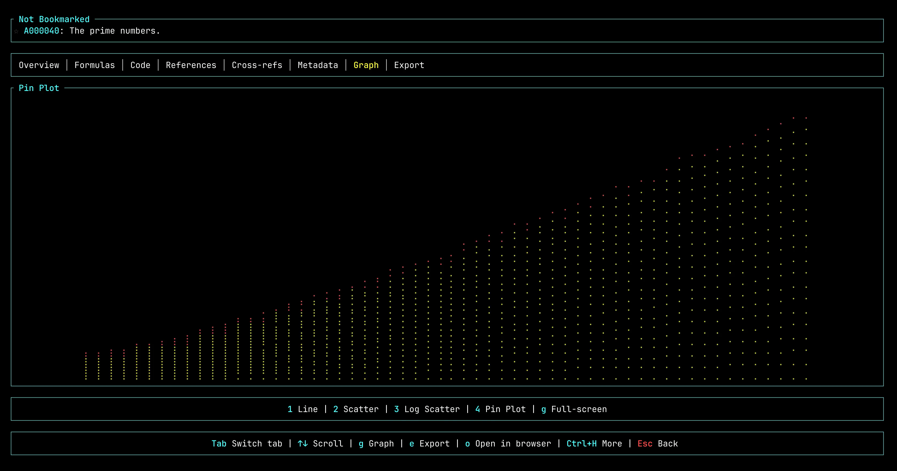<br><sub>Pin Plot (Primes)</sub></td>
  </tr>
  <tr>
    <td align="center">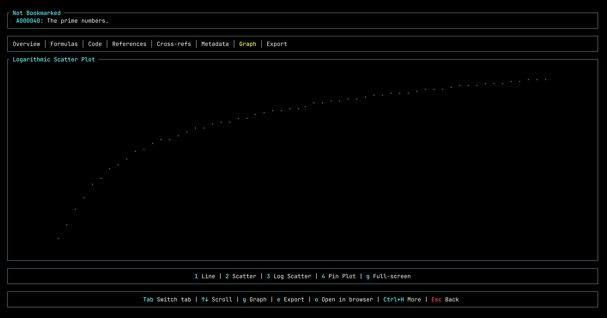<br><sub>Log Scatter</sub></td>
    <td align="center">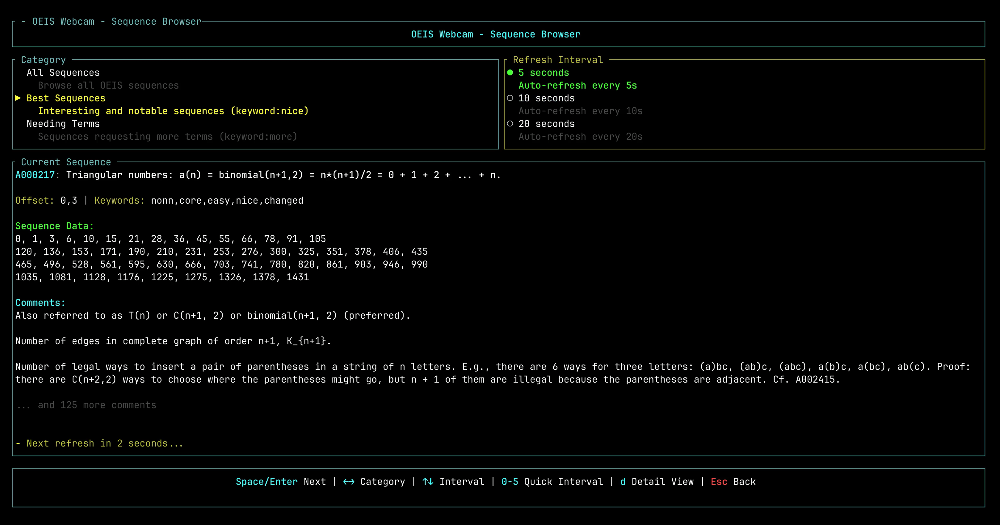<br><sub>Webcam Mode</sub></td>
    <td align="center">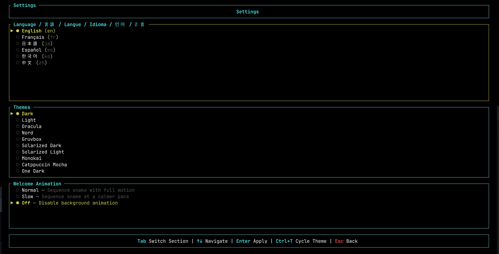<br><sub>Settings</sub></td>
  </tr>
</table>

## Usage

### TUI Mode (Default)

Launch the interactive terminal interface:

```bash
oeis
```

### CLI Commands

The CLI provides UNIX-friendly commands with multiple output formats, perfect for piping and integration with external tools.

#### Basic Commands

```bash
# Search for sequences
oeis search "1,2,3,5,8"
oeis search "fibonacci"
oeis search "keyword:prime"

# Fetch a specific sequence
oeis fetch A000045

# Get a random sequence
oeis random
```

#### Output Formats

All commands support `--format` / `-f` flag with these options:

- **`plain`** (default) - Human-readable output
- **`json`** - Complete JSON data (for `jq` and scripting)
- **`csv`** - Index,value pairs (for spreadsheets and plotters)
- **`tsv`** - Tab-separated values (gnuplot native format)
- **`values`** - Just the numbers, one per line (for simple piping)

```bash
# Get Fibonacci sequence in different formats
oeis fetch A000045 -f values        # Just numbers
oeis fetch A000045 -f csv           # index,value pairs
oeis fetch A000045 -f tsv           # Tab-separated (gnuplot)
oeis fetch A000045 -f json          # Full JSON
oeis fetch A000045 -q               # Quiet mode (no headers)
```

#### Piping and Composability

```bash
# Search and fetch multiple sequences
oeis search "fibonacci" -f values -l 5 | xargs -n1 oeis fetch

# Get just the numbers for processing
oeis fetch A000045 -f values -q | head -20

# Extract specific data with jq
oeis fetch A000045 -f json | jq '.data'

# Batch process sequences
cat sequences.txt | xargs -n1 oeis fetch -f csv > output.csv

# Search with verbose output (A-numbers + names)
oeis search "prime" -f values -v | column -t -s $'\t'
```

#### Plotting with External Tools

The CLI outputs data in formats compatible with gnuplot, matplotlib, R, and other plotting tools:

```bash
# Plot with gnuplot
oeis fetch A000045 -f tsv -q | gnuplot -p -e "plot '-' with lines"

# Save plot to file
oeis fetch A000045 -f tsv -q > fib.dat
gnuplot -e "set terminal png; set output 'fib.png'; plot 'fib.dat' with linespoints"

# Plot with matplotlib (Python)
oeis fetch A000045 -f csv -q | python -c "
import sys; import matplotlib.pyplot as plt
data = [line.split(',') for line in sys.stdin]
x, y = zip(*[(int(a), int(b)) for a, b in data])
plt.plot(x, y); plt.show()
"

# R plotting
oeis fetch A000045 -f csv | Rscript -e "
data <- read.csv('stdin', header=TRUE)
png('plot.png'); plot(data); dev.off()
"
```

#### Quick Workflows

```bash
# Daily random sequence
oeis random -q > /tmp/sequence-of-the-day.txt

# Compare two sequences side-by-side
paste <(oeis fetch A000045 -f values -q) <(oeis fetch A000079 -f values -q) | head

# Find and plot prime-related sequences
oeis search "keyword:prime" -f values | head -1 | xargs oeis fetch -f tsv -q | gnuplot -p -e "plot '-'"

# Export to spreadsheet format
oeis fetch A000045 -f csv > fibonacci.csv
```

### TUI Controls

**Global**
- `Ctrl+Q` or `Ctrl+C` - Quit
- `Ctrl+H` - Help
- `Ctrl+A` - About
- `Ctrl+T` - Cycle theme
- `Ctrl+V` - Toggle keybinding preset
- `Esc` - Go back

**Search**
- `i` or `/` - Edit search
- `Enter` - View sequence
- `↑`/`↓` or `k`/`j` - Navigate results
- `←`/`→` or `h`/`l` - Page navigation
- `r` - Random sequence
- `w` - Webcam mode
- `s` - Settings
- `p` - Toggle preview pane
- `b` - Toggle bookmarks panel
- `1-6` - Quick preview tab selection (when preview open)
- `Ctrl+U`/`Ctrl+D` - Scroll preview (vim-style)

**Detail View**
- `Tab` / `Shift+Tab` - Switch tabs
- `↑`/`↓` or `k`/`j` - Scroll content
- `←`/`→` or `h`/`l` - Navigate A-number references
- `g` - View graph
- `e` - Export tab
- `o` - Open in browser
- `b` - Toggle bookmark
- `f` - Fetch B-file data
- `Backspace` - Go back

**Graph View**
- `1-4` - Switch chart type (Line, Scatter, Log, Pin)
- `Esc` or `Backspace` - Back to detail

**Export**
- `↑`/`↓` or `k`/`j` - Select format
- `1-5` - Quick format selection (JSON, CSV, TXT, Markdown, B-File)
- `Enter` - Copy to clipboard
- `Ctrl+S` - Save to file

**Webcam Mode**
- `Space` or `Enter` - Load next sequence
- `d` - View sequence detail
- `Tab` or `→` or `l` - Next section
- `Shift+Tab` or `←` or `h` - Previous section
- `↑`/`↓` or `k`/`j` - Navigate options
- `0-5` - Quick interval (0=Manual, 1=5s, 2=10s, 3=20s, 4=30s, 5=1m)
- `Esc` or `Backspace` - Back to search

**Settings**
- `Tab` or `→` or `l` - Next panel
- `Shift+Tab` or `←` or `h` - Previous panel
- `↑`/`↓` or `k`/`j` - Navigate options
- `Enter` - Select option
- `1-6` - Quick language selection
- `Esc` or `Backspace` - Back to search

### Search Syntax

```bash
1,2,3,5,8,13,21        # Search by terms
id:A000045             # Search by A-number
keyword:nice           # Search by keyword
author:Sloane          # Search by author
name:prime             # Search in names
1,2,_,5,8              # _ matches any single number
1,2,__,7,8             # __ matches any consecutive list
```

## Cache and Configuration Location

- **macOS / Linux**: `~/.config/oeis-tui/oeis_cache.db`
- **Windows**: `%APPDATA%\oeis-tui\oeis_cache.db`

Settings live alongside the cache at `~/.config/oeis-tui/settings.json` (or the platform equivalent).

## Development

```bash
cargo run                    # Run in dev mode
cargo test                   # Run tests
cargo clippy                 # Lint
cargo fmt                    # Format
```

## Credits

All sequence data is provided by the [On-Line Encyclopedia of Integer Sequences (OEIS)](https://oeis.org), founded by Neil J. A. Sloane and maintained by The OEIS Foundation Inc. and its many contributors.

Special thanks to:
- **Neil J. A. Sloane** for creating and maintaining OEIS
- **The OEIS Foundation Inc.** for hosting and maintaining the database
- **OEIS Contributors** for their invaluable contributions to the sequences and mathematical knowledge

Sequence data © The OEIS Foundation Inc.

## License

MIT

Note: oeis-tui is not officially affiliated with the OEIS Foundation.
